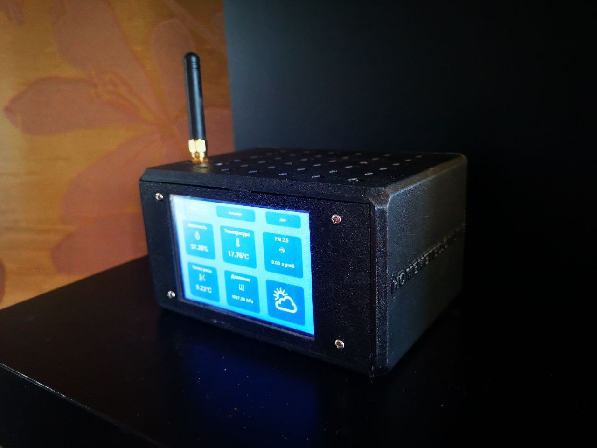
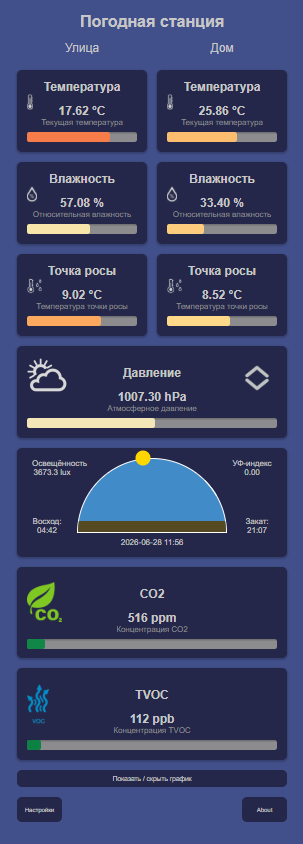
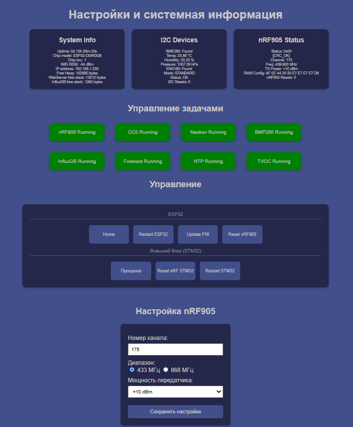

# ESP32 Meteostation

Многофункциональная домашняя метеостанция на базе ESP32 с веб-интерфейсом, локальным дисплеем Nextion, беспроводным уличным блоком на nRF905 и интеграцией с InfluxDB/Grafana.

Проект предназначен для круглосуточного мониторинга погодных параметров, качества воздуха и состояния удалённого уличного датчика с сохранением данных во внешнюю базу данных.



---

## Возможности

### Измерение параметров окружающей среды

#### Уличный блок (по радиоканалу nRF905)

- Температура воздуха
- Относительная влажность
- Точка росы
- Освещённость (Lux)
- УФ-индекс
- PM2.5
- PM10
- Состояние нагревателя датчика
- Состояние вентилятора

#### Базовая станция

- Температура помещения
- Влажность помещения
- Атмосферное давление
- Точка росы в помещении
- CO₂
- TVOC
- eCO₂
- Индекс качества воздуха (AQI)

---

## Используемые датчики

### На базовой станции

| Датчик | Назначение |
|----------|----------|
| BME280 | Температура, влажность, давление |
| ENS160 | TVOC, eCO₂, AQI |
| AHT20 | Компенсация температуры и влажности для ENS160 |
| MH-Z19 | Измерение CO₂ |

### Уличный узел

Построен на базе STM32F411CEU6:

- температуры;
- влажности;
- точки росы;
- освещённости;
- УФ-индекса;
- PM2.5;
- PM10;
- статусов вентилятора и подогрева.

---

## Используемые датчики

### На Уличном узле

| Датчик | Назначение |
|----------|----------|
| SHT31 | Температура, влажность |
| ZH07 | PM2.5, PM10 |
| S12SD | UV-индекс |
| VEML7700 | Освещенность |

## Ссылка на проект: https://github.com/Evgeny-s-eremenko/STM32_Transmitter

## Архитектура системы

```text
┌─────────────────────────┐
│ Уличный узел (STM32)    │
│ Датчики погоды          │
└──────────┬──────────────┘
           │ nRF905
           ▼
┌─────────────────────────┐
│ ESP32 базовая станция   │
│                         │
│ BME280                  │
│ ENS160 + AHT20          │
│ MH-Z19                  │
│ Nextion Display         │
│ Web Interface           │
│ OTA Update              │
└──────────┬──────────────┘
           │ WiFi
           ▼
┌─────────────────────────┐
│ InfluxDB                │
└──────────┬──────────────┘
           ▼
┌─────────────────────────┐
│ Grafana                 │
└─────────────────────────┘
```

---

## Основные функции

### Веб-интерфейс



Главная страница отображает:

- температуру;
- влажность;
- давление;
- точку росы;
- CO₂;
- TVOC;
- PM2.5;
- PM10;
- освещённость;
- УФ-индекс;
- прогноз погоды.

Интерфейс работает через AJAX-запросы к ESP32 и получает данные в формате JSON.

---

### Административная панель



Доступ защищён Basic Authentication.

Возможности:

- просмотр системной информации;
- контроль состояния задач FreeRTOS;
- диагностика датчиков I²C;
- диагностика радиомодуля nRF905;
- изменение параметров nRF905 без перепрошивки;
- перезапуск устройства;
- OTA-обновление.

---

### OTA обновление

Поддерживается обновление:

- основной прошивки (`firmware.bin`);
- файловой системы (`littlefs.bin`).

Загрузка выполняется через браузер.

---

### Интеграция с InfluxDB

ESP32 периодически отправляет данные в InfluxDB по HTTP.

Сохраняются:

- погодные параметры;
- данные качества воздуха;
- показания уличного блока;
- служебные параметры станции.

Данные могут визуализироваться через Grafana.

---

### Прогноз погоды

Используется библиотека Forecaster.

Прогноз строится по тенденции изменения атмосферного давления.

---

### Восход и закат

На основе координат станции рассчитываются:

- время восхода;
- время заката.

Для расчётов используется библиотека SunSet.

---

### Nextion Display

Поддерживается вывод информации на дисплей Nextion через UART.

Отображаются:

- погодные параметры;
- качество воздуха;
- прогноз;
- служебная информация.

---

## Используемые интерфейсы

### WiFi

- подключение к локальной сети;
- синхронизация времени через NTP;
- веб-интерфейс;
- передача данных в InfluxDB.

### nRF905

Рабочие параметры можно изменять через веб-интерфейс:

- канал;
- диапазон частот;
- мощность передатчика.

Поддерживается диагностика и программный сброс модуля.

### UART

| Интерфейс | Назначение |
|------------|------------|
| UART1 | MH-Z19 |
| UART2 | Nextion |

---

## FreeRTOS

Проект использует отдельные задачи для:

- приёма данных nRF905;
- чтения MH-Z19;
- работы с Nextion;
- опроса BME280;
- опроса ENS160;
- расчёта прогноза;
- получения времени NTP;
- отправки данных в InfluxDB.

Состояние задач доступно через WebSocket и административную панель.

---

## Файловая система

Используется LittleFS.

Содержит:

```text
/index.html
/admin.html
/about.html
/updateform.html
/script.js
/restart.js
/update.js
```

---

## Конфигурация

Создайте файл:

```cpp
secrets.h
```

на основе шаблона:

```cpp
secrets.h.example
```

### Настраиваемые параметры

#### WiFi

```cpp
#define SECRET_WIFI_SSID
#define SECRET_WIFI_PASSWORD
```

#### Авторизация

```cpp
#define SECRET_HTTP_USER
#define SECRET_HTTP_PASSWORD
```

#### InfluxDB

```cpp
#define SECRET_INFLUX_HOST
#define SECRET_INFLUX_PORT
#define SECRET_INFLUX_DATABASE
```

#### NTP

```cpp
#define SECRET_NTP_SERVER
#define SECRET_TZ_OFFSET_SEC
```

#### Географические координаты

```cpp
#define SECRET_LATITUDE
#define SECRET_LONGITUDE
#define SECRET_TZ_OFFSET
```

---

## HTTP API

### Получение текущих данных

```http
GET /graph-data
```

Возвращает JSON со всеми измерениями.

### Системная информация

```http
GET /sysinfo
```

### Состояние датчиков

```http
GET /bmeinfo
```

### Состояние радиомодуля

```http
GET /nrf905Status
```

### Перезапуск станции

```http
GET /restart
```

### Управление задачами

```http
GET /getTasksState
POST /toggleTask
```

### OTA

```http
GET  /updateform
POST /update
```

---

## Защита и отказоустойчивость

Реализованы:

- контроль подключения WiFi;
- автоматическое переподключение;
- аппаратный сброс nRF905;
- восстановление шины I²C при зависании устройств;
- контроль мьютексов FreeRTOS;
- автоматическая перезагрузка при критических ошибках.

---

## Требования

### Аппаратная часть

- ESP32 DevKit V1
- BME280
- ENS160
- AHT20
- MH-Z19
- nRF905
- дисплей Nextion
- WiFi-сеть
- сервер InfluxDB (опционально)

### Среда разработки

- PlatformIO
- Framework Arduino
- LittleFS

---

## Структура проекта

```text
ESP32_meteostation/
├── data/
│   ├── index.html
│   ├── admin.html
│   ├── about.html
│   ├── updateform.html
│   ├── script.js
│   ├── restart.js
│   └── update.js
│
├── src/
│   └── main.cpp
│
├── secrets.h.example
├── platformio.ini
└── README.md
```

---

## Статус проекта

Проект находится в активной разработке. Основное направление развития:

- расширение набора поддерживаемых датчиков;
- улучшение веб-интерфейса;
- развитие диагностических функций;
- повышение устойчивости радиоканала;
- расширение интеграции с системами мониторинга.
