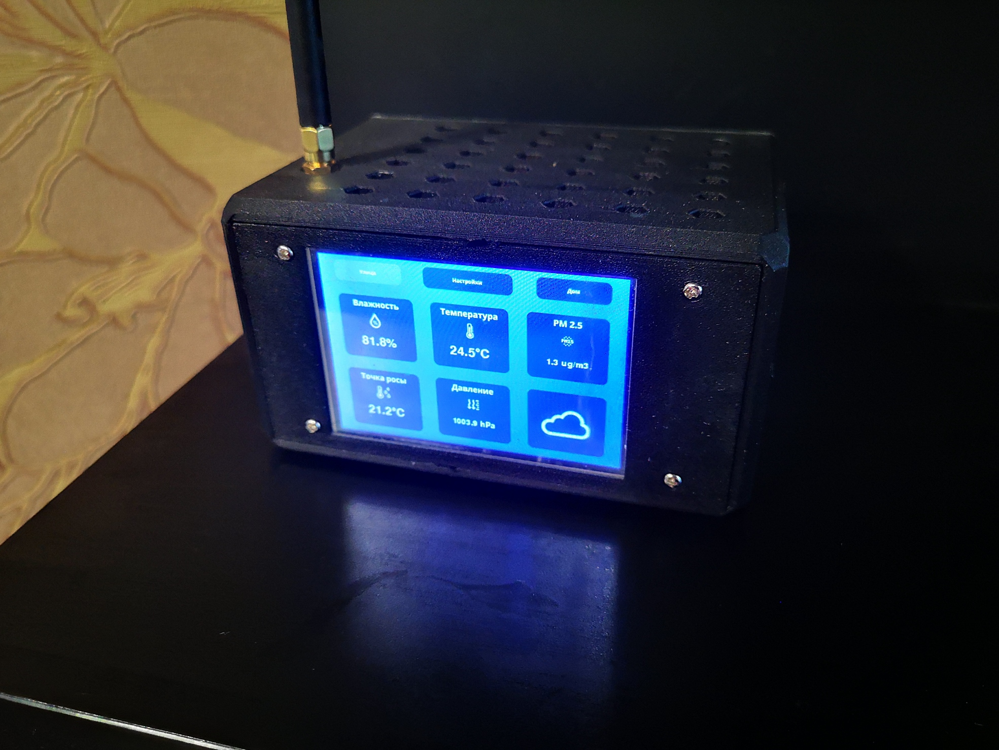
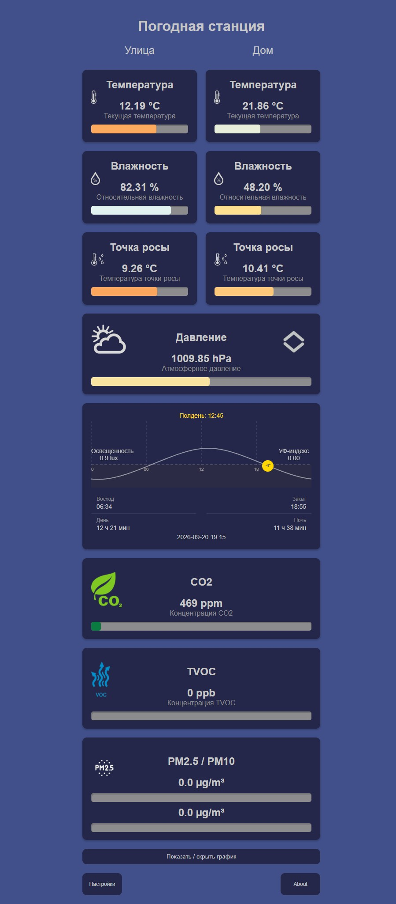
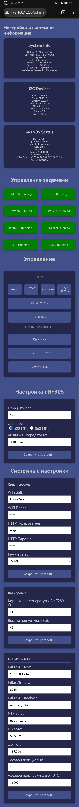

# ESP32 Meteostation

Многофункциональная домашняя метеостанция на базе ESP32 с веб-интерфейсом, локальным дисплеем Nextion, беспроводным уличным блоком на nRF905 и интеграцией с InfluxDB/Grafana.

Проект предназначен для круглосуточного мониторинга погодных параметров, качества воздуха и состояния удалённого уличного датчика с сохранением данных во внешнюю базу данных.



---

## Поддерживаемые платформы

Проект поддерживает две платформы с переключением через `pio run`:

| Платформа | Board | Flash | PSRAM | Сборка |
|-----------|-------|-------|-------|--------|
| ESP32 DevKit V1 | `esp32dev` | 4 MB | — | `pio run -e esp32dev` |
| ESP32-S3-WROOM-1 N16R8 | `esp32-s3-devkitc-1` | 16 MB | 8 MB | `pio run -e esp32s3` |

Определения пинов вынесены в `include/board_config.h` и выбираются автоматически через `#ifdef ESP32S3`.

На ESP32-S3 подключены дополнительные пины nRF905 (DR, AM) для прерывательного режима приёма данных вместо поллинга.

---

## Возможности

### Измерение параметров окружающей среды

#### Уличный блок (по радиоканалу nRF905)

- Температура воздуха
- Относительная влажность
- Точка росы
- Освещённость (Lux)
- УФ-индекс
- PM2.5 / PM10
- Состояние нагревателя датчика
- Состояние вентилятора

#### Базовая станция

- Температура помещения
- Влажность помещения
- Атмосферное давление
- Точка росы в помещении
- CO₂
- TVOC / eCO₂
- Индекс качества воздуха (AQI)

---

## Используемые датчики

### На базовой станции

| Датчик | Назначение |
|----------|----------|
| BME280 | Температура, влажность, давление |
| ENS160 | TVOC, eCO₂, AQI |
| AHT20 | Компенсация температуры и влажности для ENS160 |
| MH-Z19 | Измерение CO₂ |

### На уличном узле

Уличный узел построен на базе STM32F411CEU6 (проект: [STM32_Transmitter](https://github.com/Evgeny-s-eremenko/STM32_Transmitter)):

| Датчик | Назначение |
|----------|----------|
| SHT31 | Температура, влажность |
| ZH07 | PM2.5, PM10 |
| S12SD | UV-индекс |
| VEML7700 | Освещённость |

---

## Архитектура системы

```text
┌─────────────────────────┐
│ Уличный узел (STM32)    │
│ Датчики погоды          │
└──────────┬──────────────┘
           │ nRF905
           ▼
┌─────────────────────────┐
│ ESP32/S3 базовая станция│
│                         │
│ BME280                  │
│ ENS160 + AHT20          │
│ MH-Z19                  │
│ Nextion Display         │
│ Web Interface           │
│ OTA Update              │
└──────────┬──────────────┘
           │ WiFi
           ▼
┌─────────────────────────┐
│ InfluxDB                │
└──────────┬──────────────┘
           ▼
┌─────────────────────────┐
│ Grafana                 │
└─────────────────────────┘
```

---

## Основные функции

### Веб-интерфейс



Главная страница отображает все измерения в реальном времени:

- температуру, влажность, давление, точку росы;
- CO₂, TVOC, PM2.5, PM10;
- освещённость, УФ-индекс;
- прогноз погоды.

Интерфейс работает через AJAX-запросы к ESP32 и получает данные в формате JSON.

---

### Административная панель



Доступ защищён Basic Authentication.

Возможности:

- просмотр системной информации (Chip Model, Free Heap, Max Alloc, uptime, RSSI, стек задач);
- контроль состояния задач FreeRTOS;
- диагностика датчиков I²C;
- диагностика радиомодуля nRF905;
- настройка nRF905 (канал, диапазон, мощность) с сохранением в NVS;
- системные настройки (WiFi, InfluxDB, NTP, координаты, статический IP) с сохранением в NVS;
- сброс NVS до заводских настроек;
- предупреждение о нехватке памяти (LOW MEMORY);
- перезапуск устройства;
- OTA-обновление.

---

### OTA обновление

Поддерживается обновление:

- основной прошивки (`firmware.bin`);
- файловой системы (`littlefs.bin`).

Загрузка выполняется через браузер.

---

### Интеграция с InfluxDB

ESP32 периодически отправляет данные в InfluxDB по HTTP (раз в 60 секунд).

Сохраняются:

- погодные параметры (температура, влажность, давление, точка росы);
- данные качества воздуха (CO₂, TVOC, AQI, eCO₂);
- показания уличного блока (PM2.5, PM10, освещённость, УФ);
- статусы нагревателя и вентилятора;
- прогноз и тренд давления.

Данные визуализируются через Grafana.

---

### Прогноз погоды

Используется библиотека Forecaster (алгоритм Замбретти).

Прогноз строится по тенденции изменения атмосферного давления, обновляется каждые 30 минут.

---

### Астрономические расчёты

На основе координат станции рассчитываются:

- время восхода и заката (библиотека SunSet);
- текущая высота солнца над горизонтом;
- время истинного полдня.

Данные передаются по WebSocket (`/ws1`) и отображаются на дисплее.

---

### Nextion Display

Поддерживается вывод информации на дисплей Nextion через UART (4 страницы):

| Страница | Содержание |
|----------|-----------|
| Page 0 | Уличные данные (T, H, давление, прогноз) |
| Page 1 | Домашние данные (T, H, CO₂, TVOC) |
| Page 2 | Управление задачами (кнопки-тумблеры) |
| Page 3 | Системная информация (WiFi, IP, RAM, uptime) |

Через дисплей доступна настройка WiFi (ввод SSID и пароля).

---

## Используемые интерфейсы

### WiFi

- подключение к локальной сети;
- синхронизация времени через NTP;
- веб-интерфейс;
- передача данных в InfluxDB;
- настройка статического IP через веб.

### nRF905

Рабочие параметры настраиваются через веб-интерфейс или дисплей Nextion:

- канал;
- диапазон частот;
- мощность передатчика.

Настройки сохраняются в NVS и восстанавливаются при перезагрузке.

Поддерживается диагностика и программный сброс модуля.

#### Восстановление связи

При отсутствии данных от уличного блока запускается цикл восстановления:

1. 5 мин без данных → сброс локального nRF905 + команда `NRF_REST` на внешний блок
2. ещё 5 мин → повторный `NRF_REST`
3. ещё 5 мин → команда `REST` (полный перезапуск STM32)

При получении данных на любой стадии цикл сбрасывается.

### UART

| Интерфейс | Назначение |
|------------|------------|
| UART1 | MH-Z19 |
| UART2 | Nextion |

---

## FreeRTOS

Проект использует отдельные задачи для:

- приёма данных nRF905 (RX);
- отправки команд nRF905 (TX);
- чтения MH-Z19 (CO2);
- работы с Nextion;
- опроса BME280;
- опроса ENS160 + AHT20 (TVOC);
- расчёта прогноза;
- получения времени NTP;
- отправки данных в InfluxDB;
- мониторинга WiFi (`WiFiMonitor`);
- мониторинга свободной памяти (`HeapMonitor`).

Состояние задач доступно через WebSocket (`/ws`) и административную панель.

#### Мониторинг памяти

Фоновая задача `HeapMonitor` каждые 60 секунд логирует `Free Heap` и `Max Alloc`. При падении ниже 32 КБ — предупреждение, ниже 16 КБ — аварийный рестарт.

---

## Файловая система

Используется LittleFS.

```text
/index.html       — главная страница
/admin.html       — административная панель
/about.html       — информация о проекте
/updateform.html  — форма OTA-обновления
/script.js        — AJAX-запросы данных
/restart.js       — перезапуск устройства
/update.js        — OTA-загрузка
/sunset.js        — данные восхода/заката
```

---

## Конфигурация

### Начальная настройка

Создайте файл `secrets.h` на основе шаблона `secrets.h.example`:

```bash
cp secrets.h.example secrets.h
```

Задайте начальные параметры — они будут использованы при первой загрузке.

### Персистентность настроек

Все параметры сохраняются в NVS (Non-Volatile Storage) и восстанавливаются при перезагрузке. Изменения применяются через веб-интерфейс `admin.html` и сохраняются независимо от прошивки.

#### nRF905 (NVS: `nrf905`)

- канал
- диапазон частот
- мощность передатчика

#### Системные настройки (NVS: `settings`)

- WiFi SSID и пароль
- HTTP пользователь и пароль
- Статический IP / DHCP
- InfluxDB хост, порт, база данных
- NTP сервер, часовой пояс
- Широта, долгота

### Начальные значения (secrets.h)

```cpp
// WiFi
#define SECRET_WIFI_SSID        "your_wifi_ssid"
#define SECRET_WIFI_PASSWORD    "your_wifi_password"

// Авторизация
#define SECRET_HTTP_USER        "admin"
#define SECRET_HTTP_PASSWORD    "your_http_password"

// InfluxDB
#define SECRET_INFLUX_HOST      "your_influxdb_ip"
#define SECRET_INFLUX_PORT      8086
#define SECRET_INFLUX_DATABASE  "your_database"

// NTP
#define SECRET_NTP_SERVER       "pool.ntp.org"
#define SECRET_TZ_OFFSET_SEC    10800   // UTC+3

// Координаты
#define SECRET_LATITUDE         55.75
#define SECRET_LONGITUDE        37.62
#define SECRET_TZ_OFFSET        3
```

---

## HTTP API

### Данные

| Метод | Эндпоинт | Описание |
|-------|----------|----------|
| GET | `/graph-data` | JSON со всеми измерениями |
| GET | `/sysinfo` | Системная информация (Chip, Heap, Uptime, RSSI) |
| GET | `/bmeinfo` | Статус датчиков I²C |
| GET | `/nrf905Status` | Регистры и параметры nRF905 |

### Управление

| Метод | Эндпоинт | Описание |
|-------|----------|----------|
| POST | `/toggleTask` | Переключение задачи (`task=nRF905\|CO2\|nextion\|...`) |
| GET | `/getTasksState` | Состояние всех задач (JSON) |
| POST | `/sendCommand` | Команда STM32 (`cmd=HEATER\|NRF_REST\|REST`) |
| POST | `/restart` | Перезагрузка станции |
| POST | `/nrfreset` | Сброс nRF905 |
| POST | `/resetNVS` | Сброс NVS до заводских настроек |

### Настройки

| Метод | Эндпоинт | Описание |
|-------|----------|----------|
| GET | `/getSettings` | Получение системных настроек (JSON) |
| POST | `/setSettings` | Сохранение системных настроек |
| POST | `/setNRF905` | Настройка nRF905 (`channel`, `band`, `power`) |

### OTA

| Метод | Эндпоинт | Описание |
|-------|----------|----------|
| GET | `/updateform` | Страница загрузки прошивки |
| POST | `/update` | Загрузка `firmware.bin` или `littlefs.bin` |

### WebSocket

| Эндпоинт | Данные |
|----------|--------|
| `/ws` | Состояние задач FreeRTOS (JSON, обновление при изменении) |
| `/ws1` | Время, восход/закат, высота солнца, истинный полдень |

---

## Защита и отказоустойчивость

Реализованы:

- контроль подключения WiFi и автоматическое переподключение;
- аппаратный сброс nRF905;
- цикл восстановления связи с внешним блоком (`NRF_REST` → `REST`);
- восстановление шины I²C при зависании устройств;
- контроль мьютексов FreeRTOS;
- мониторинг свободной памяти с аварийным рестартом;
- безопасное удаление объектов (`safeDelete` / `safeDeleteArray`);
- персистентность настроек в NVS;
- автоматическая перезагрузка при критических ошибках.

---

## Требования

### Аппаратная часть

| Компонент | Примечание |
|-----------|-----------|
| ESP32 DevKit V1 **или** ESP32-S3-WROOM-1 N16R8 | Сборка под обе платформы |
| BME280 | Давление, температура, влажность |
| ENS160 | TVOC, eCO₂, AQI |
| AHT20 | Компенсация для ENS160 |
| MH-Z19 | CO₂ |
| nRF905 | Радиоканал со STM32 |
| Дисплей Nextion | Локальный вывод данных |
| WiFi-сеть | Обязательно |
| Сервер InfluxDB | Опционально |

### Среда разработки

- [PlatformIO](https://platformio.org/)
- Framework Arduino
- LittleFS

---

## Сборка

```bash
# ESP32 (classic)
pio run -e esp32dev

# ESP32-S3 N16R8
pio run -e esp32s3

# Прошивка
pio run -e esp32dev --target upload
pio run -e esp32s3 --target upload

# Загрузка файловой системы
pio run -e esp32dev --target uploadfs
pio run -e esp32s3 --target uploadfs
```

---

## Структура проекта

```text
ESP32_meteostation/
├── data/                    # LittleFS (веб-интерфейс)
│   ├── index.html
│   ├── admin.html
│   ├── about.html
│   ├── updateform.html
│   ├── script.js
│   ├── restart.js
│   ├── update.js
│   ├── sunset.js
│   └── *.png                # Иконки и изображения
│
├── include/
│   └── board_config.h       # Пины per-board (ESP32 / ESP32-S3)
│
├── lib/
│   └── Forecaster/          # Библиотека прогноза погоды
│
├── src/
│   └── main.cpp             # Основной код
│
├── PCB_EasyEDA/             # Платы и схемы
├── Nextion display project/ # Проект дисплея
│
├── secrets.h.example        # Шаблон конфигурации
├── platformio.ini           # Конфигурация сборки
├── LICENSE                  # CC BY-NC 4.0
└── README.MD
```

---

## Лицензия

Проект распространяется под лицензией [CC BY-NC 4.0](LICENSE) (Creative Commons Attribution-NonCommercial 4.0 International).

Свободное использование, включая модификацию и распространение, только для некоммерческих целей. Обязательное указание авторства при копировании.

---

## Статус проекта

Проект находится в активной разработке. Основные направления:

- расширение набора поддерживаемых датчиков;
- улучшение веб-интерфейса;
- развитие диагностических функций;
- повышение устойчивости радиоканала;
- расширение интеграции с системами мониторинга.
